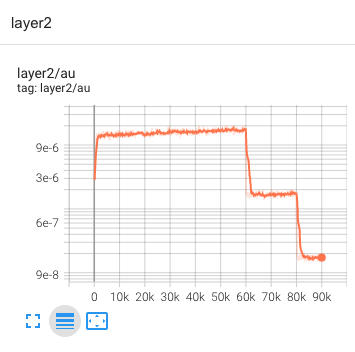

# Augular update check

This tutorial explains how to visualize auglar update of layers.

The concept of au (short for angular update) is proposed in our [SMD paper](https://arxiv.org/abs/2006.08419), which is used to analyze the dynamics of neural networks.

## Step1: Visualization command

We provide a tool in our train script `train_net.py` to help you visualize the ERF of your model. 

For quick starter, make sure that you have installed cvpods in the right way.

Here is a command example to anaylyze the angular update in cvpods training:
```shell
pods_train --dir /path/to/your/ --angular MODEL.RESNETS.NORM "BN"
```
* `--augular` is crucial here, it enables recording augular update value into tensorboard.
* `MODEL.RESNETS.NORM BN` is used here to make sure the dynamics of norm in your module is recordable.


After training the who model, open your tensorboard log and you will see the `au` curve of every layer.

Let's go to the next step.

## Step2: Check the visualization result

Here is an example of visualization result in tensorboard:
<div align="center"></div>

The figure show the similar result with our paper, for more details, please read our paper and post issue here.