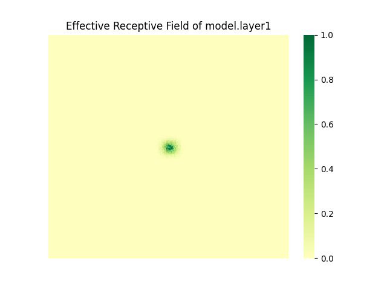

# Visualize ERF(effective receptive field)

This tutorial explains how to visualize the ERF of layers in the model.

## Step1: Visualization command

We provide a tool named `visualize_erf.py` to help you visualize the ERF of your model. 

For quick starter, make sure that you have installed [timm](https://github.com/huggingface/pytorch-image-models).  Please install it with ```python3 -m pip install timm```.

Here is an example to show the ERF of `layer1` in timm `ResNet50`.
```shell
python3 visualize_erf.py --model resnet50 --name_list layer1
```

And you will see the quantitative analysis of ERF shown on your terminal:

```shell
ERF analysis of model.layer1:
        Threshold        0.2     0.3     0.5     0.99
        Area Ratio      0.0007  0.0012  0.0018  0.0147
        Side Length     7       9       11      31
```

Then, a figure will be saved in the path, let's open it and go on.


## Step2: Check the visualization result

Here is an example of visualization result:
<div align="center"></div>

We report the high-contribution *area ratio* and the *side length* of a minimum square that covers the contribution scores over a given *threshold*.
