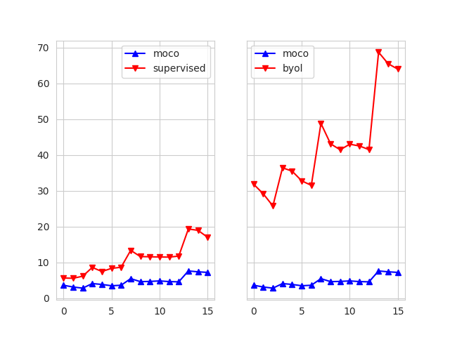

# Analyze the weights of the model

This tutorial explains how to use the weight-analysis tool.

The tool analyzes the statistics of model weights, which helps to improve the generalization ability of the model.

By comparing of mean, variance, norm, or maximum value of the target model and the anchor model with high transfer performance, we could know **how to tune the target model to get close to the anchor model and achieve better performance without tuning lots of hyper-parameters**.

## Visualization command
We provide this tool to compare the statistical value between anchor and target models.
When the statistics are closer to the anchor model, the target model can achieve better transfer performance without funing hyperparameters.

Here is an example to analyze the norm values between ```moco``` weights and ```byol```/```supervised``` weights on ResNet50.
The default ```--name_filter``` is set to ```conv2```, which means the module named `conv2` will be analyzed.
```
python3 visualize_weight_analysis.py --name_filter conv2 --save_path /path/to/save/figures
```

Then, a image file will be saved in the path `/path/to/save/figures/analyze_norm.png`, here is an example:
<div align="center"></div>

As shown in the figure, **the norm value of byol weights is far from that of moco weights, resulting in the lower transfer performances of byol than moco on downstream tasks**.

For more details, please read [our paper](https://arxiv.org/pdf/2208.00275.pdf) and post a issue.
